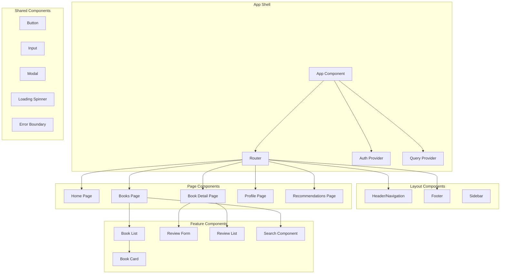
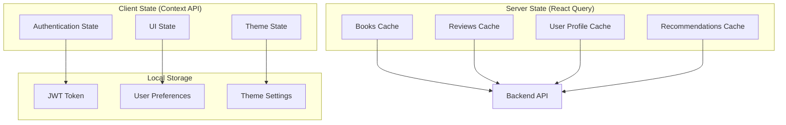

# Frontend Design Document

## Overview

The Book Review Platform frontend will be built as a modern, responsive React application with TypeScript. The system will provide an intuitive user interface for book discovery, review management, and personalized recommendations with comprehensive accessibility and performance optimization.

### Technology Stack

**Frontend:**
- **Framework:** React with TypeScript for component-based UI development
- **State Management:** React Query for server state and Context API for client state
- **Routing:** React Router for client-side navigation
- **Styling:** Tailwind CSS for utility-first styling and responsive design
- **Forms:** React Hook Form with Zod for validation
- **Testing:** Jest and React Testing Library for component testing
- **Build Tool:** Vite for fast development and optimized builds

**Infrastructure:**
- **Hosting:** AWS S3 for static website hosting
- **CDN:** AWS CloudFront for global content delivery and performance
- **Domain:** AWS Route 53 for DNS management
- **SSL:** AWS Certificate Manager for HTTPS

## Architecture

### Component Architecture



### State Management Architecture



## Component Design

### Authentication Components

```typescript
interface AuthComponents {
  // Main authentication wrapper
  AuthProvider: React.FC<{
    children: React.ReactNode
  }>
  
  // Login form with validation
  LoginForm: React.FC<{
    onSuccess?: () => void
    redirectTo?: string
  }>
  
  // Registration form with validation
  RegisterForm: React.FC<{
    onSuccess?: () => void
    redirectTo?: string
  }>
  
  // Protected route wrapper
  ProtectedRoute: React.FC<{
    children: React.ReactNode
    fallback?: React.ReactNode
  }>
  
  // User menu dropdown
  UserMenu: React.FC<{
    user: User
    onLogout: () => void
  }>
}
```

### Book Components

```typescript
interface BookComponents {
  // Main book listing with pagination
  BookList: React.FC<{
    books: Book[]
    loading?: boolean
    error?: string
    onPageChange: (page: number) => void
    currentPage: number
    totalPages: number
  }>
  
  // Individual book card
  BookCard: React.FC<{
    book: Book
    showFavoriteButton?: boolean
    onFavoriteToggle?: (bookId: string) => void
    isFavorite?: boolean
  }>
  
  // Detailed book view
  BookDetail: React.FC<{
    book: Book
    reviews: Review[]
    userReview?: Review
    onReviewSubmit: (review: CreateReviewRequest) => void
    onReviewUpdate: (reviewId: string, review: UpdateReviewRequest) => void
    onReviewDelete: (reviewId: string) => void
  }>
  
  // Search and filter interface
  BookSearch: React.FC<{
    onSearch: (query: string) => void
    onFilterChange: (filters: BookFilters) => void
    filters: BookFilters
    loading?: boolean
  }>
  
  // Pagination controls
  Pagination: React.FC<{
    currentPage: number
    totalPages: number
    onPageChange: (page: number) => void
    showPageNumbers?: boolean
  }>
}
```

### Review Components

```typescript
interface ReviewComponents {
  // Review creation/editing form
  ReviewForm: React.FC<{
    initialData?: Partial<Review>
    onSubmit: (review: CreateReviewRequest | UpdateReviewRequest) => void
    onCancel?: () => void
    loading?: boolean
  }>
  
  // List of reviews for a book
  ReviewList: React.FC<{
    reviews: Review[]
    currentUserId?: string
    onEdit: (review: Review) => void
    onDelete: (reviewId: string) => void
    loading?: boolean
  }>
  
  // Individual review display
  ReviewCard: React.FC<{
    review: Review
    showActions?: boolean
    onEdit?: () => void
    onDelete?: () => void
  }>
  
  // Star rating display
  RatingDisplay: React.FC<{
    rating: number
    maxRating?: number
    size?: 'small' | 'medium' | 'large'
    showNumber?: boolean
  }>
  
  // Interactive star rating input
  RatingInput: React.FC<{
    value: number
    onChange: (rating: number) => void
    maxRating?: number
    size?: 'small' | 'medium' | 'large'
    disabled?: boolean
  }>
}
```

### User Profile Components

```typescript
interface ProfileComponents {
  // Main profile page layout
  UserProfile: React.FC<{
    user: User
    stats: UserStats
    onUpdateProfile: (data: UpdateProfileRequest) => void
  }>
  
  // User's review history
  ReviewHistory: React.FC<{
    reviews: Review[]
    onEdit: (review: Review) => void
    onDelete: (reviewId: string) => void
    loading?: boolean
  }>
  
  // User's favorite books
  FavoriteBooks: React.FC<{
    books: Book[]
    onRemoveFavorite: (bookId: string) => void
    loading?: boolean
  }>
  
  // Personalized recommendations
  RecommendationList: React.FC<{
    recommendations: Recommendation[]
    onRefresh: () => void
    loading?: boolean
    error?: string
  }>
}
```

### Shared UI Components

```typescript
interface SharedComponents {
  // Reusable button component
  Button: React.FC<{
    variant?: 'primary' | 'secondary' | 'danger' | 'ghost'
    size?: 'small' | 'medium' | 'large'
    loading?: boolean
    disabled?: boolean
    onClick?: () => void
    children: React.ReactNode
  }>
  
  // Form input component
  Input: React.FC<{
    type?: string
    placeholder?: string
    value: string
    onChange: (value: string) => void
    error?: string
    label?: string
    required?: boolean
  }>
  
  // Modal dialog component
  Modal: React.FC<{
    isOpen: boolean
    onClose: () => void
    title?: string
    children: React.ReactNode
    size?: 'small' | 'medium' | 'large'
  }>
  
  // Loading spinner component
  LoadingSpinner: React.FC<{
    size?: 'small' | 'medium' | 'large'
    color?: string
  }>
  
  // Error boundary component
  ErrorBoundary: React.FC<{
    children: React.ReactNode
    fallback?: React.ReactNode
  }>
}
```

## Data Flow and State Management

### Authentication Flow

```typescript
// Authentication context
interface AuthContextType {
  user: User | null
  token: string | null
  login: (credentials: LoginRequest) => Promise<void>
  register: (userData: RegisterRequest) => Promise<void>
  logout: () => void
  loading: boolean
  error: string | null
}

// Authentication hook
const useAuth = (): AuthContextType => {
  // Implementation with context and local storage
}
```

### API Integration with React Query

```typescript
// Book queries
const useBooks = (filters: BookFilters, page: number) => {
  return useQuery({
    queryKey: ['books', filters, page],
    queryFn: () => bookApi.getBooks(filters, page),
    staleTime: 5 * 60 * 1000, // 5 minutes
  })
}

const useBook = (bookId: string) => {
  return useQuery({
    queryKey: ['book', bookId],
    queryFn: () => bookApi.getBook(bookId),
    enabled: !!bookId,
  })
}

// Review mutations
const useCreateReview = () => {
  const queryClient = useQueryClient()
  
  return useMutation({
    mutationFn: reviewApi.createReview,
    onSuccess: (data) => {
      // Invalidate and refetch related queries
      queryClient.invalidateQueries(['reviews', data.bookId])
      queryClient.invalidateQueries(['book', data.bookId])
    },
  })
}
```

## Responsive Design Strategy

### Breakpoint System

```typescript
// Tailwind CSS breakpoints
const breakpoints = {
  sm: '640px',   // Mobile landscape
  md: '768px',   // Tablet
  lg: '1024px',  // Desktop
  xl: '1280px',  // Large desktop
  '2xl': '1536px' // Extra large desktop
}

// Component responsive behavior
interface ResponsiveProps {
  // Mobile-first approach
  cols?: number // Default mobile columns
  smCols?: number // Small screen columns
  mdCols?: number // Medium screen columns
  lgCols?: number // Large screen columns
}
```

### Layout Patterns

```typescript
// Grid layout for book cards
const BookGrid: React.FC = () => (
  <div className="grid grid-cols-1 sm:grid-cols-2 md:grid-cols-3 lg:grid-cols-4 xl:grid-cols-5 gap-4">
    {books.map(book => <BookCard key={book.id} book={book} />)}
  </div>
)

// Responsive navigation
const Navigation: React.FC = () => (
  <nav className="flex flex-col md:flex-row items-center justify-between p-4">
    <div className="flex items-center mb-4 md:mb-0">
      <Logo />
    </div>
    <div className="hidden md:flex space-x-4">
      <NavLinks />
    </div>
    <div className="md:hidden">
      <MobileMenu />
    </div>
  </nav>
)
```

## Performance Optimization

### Code Splitting and Lazy Loading

```typescript
// Route-based code splitting
const HomePage = lazy(() => import('./pages/HomePage'))
const BooksPage = lazy(() => import('./pages/BooksPage'))
const BookDetailPage = lazy(() => import('./pages/BookDetailPage'))
const ProfilePage = lazy(() => import('./pages/ProfilePage'))

// Component lazy loading
const RecommendationsPage = lazy(() => import('./pages/RecommendationsPage'))

// Image lazy loading
const LazyImage: React.FC<{src: string, alt: string}> = ({src, alt}) => (
  
)
```

### Caching Strategy

```typescript
// React Query configuration
const queryClient = new QueryClient({
  defaultOptions: {
    queries: {
      staleTime: 5 * 60 * 1000, // 5 minutes
      cacheTime: 10 * 60 * 1000, // 10 minutes
      retry: 3,
      retryDelay: attemptIndex => Math.min(1000 * 2 ** attemptIndex, 30000),
    },
  },
})

// Service worker for offline caching
const cacheStrategy = {
  books: 'cache-first', // Books change infrequently
  reviews: 'network-first', // Reviews need fresh data
  recommendations: 'stale-while-revalidate', // AI recommendations can be stale
}
```

## Accessibility Implementation

### ARIA and Semantic HTML

```typescript
// Accessible form components
const AccessibleInput: React.FC<InputProps> = ({
  label,
  error,
  required,
  ...props
}) => (
  <div className="form-field">
    <label 
      htmlFor={props.id}
      className={`form-label ${required ? 'required' : ''}`}
    >
      {label}
    </label>
    <input
      {...props}
      aria-invalid={!!error}
      aria-describedby={error ? `${props.id}-error` : undefined}
      aria-required={required}
      className={`form-input ${error ? 'error' : ''}`}
    />
    {error && (
      <div 
        id={`${props.id}-error`}
        role="alert"
        className="form-error"
      >
        {error}
      </div>
    )}
  </div>
)

// Accessible navigation
const AccessibleNavigation: React.FC = () => (
  <nav role="navigation" aria-label="Main navigation">
    <ul className="nav-list">
      <li><a href="/books" aria-current={isActive('/books') ? 'page' : undefined}>Books</a></li>
      <li><a href="/profile" aria-current={isActive('/profile') ? 'page' : undefined}>Profile</a></li>
    </ul>
  </nav>
)
```

### Keyboard Navigation

```typescript
// Keyboard navigation hook
const useKeyboardNavigation = (items: any[], onSelect: (item: any) => void) => {
  const [focusedIndex, setFocusedIndex] = useState(-1)
  
  const handleKeyDown = (event: KeyboardEvent) => {
    switch (event.key) {
      case 'ArrowDown':
        event.preventDefault()
        setFocusedIndex(prev => Math.min(prev + 1, items.length - 1))
        break
      case 'ArrowUp':
        event.preventDefault()
        setFocusedIndex(prev => Math.max(prev - 1, 0))
        break
      case 'Enter':
        event.preventDefault()
        if (focusedIndex >= 0) {
          onSelect(items[focusedIndex])
        }
        break
      case 'Escape':
        setFocusedIndex(-1)
        break
    }
  }
  
  return { focusedIndex, handleKeyDown }
}
```

## Testing Strategy

### Component Testing

```typescript
// Example component test
describe('BookCard', () => {
  const mockBook: Book = {
    id: '1',
    title: 'Test Book',
    author: 'Test Author',
    averageRating: 4.5,
    coverImageUrl: 'test.jpg'
  }
  
  test('renders book information correctly', () => {
    render(<BookCard book={mockBook} />)
    
    expect(screen.getByText('Test Book')).toBeInTheDocument()
    expect(screen.getByText('Test Author')).toBeInTheDocument()
    expect(screen.getByRole('img', { name: /test book/i })).toBeInTheDocument()
  })
  
  test('handles favorite button click', async () => {
    const onFavoriteToggle = jest.fn()
    render(
      <BookCard 
        book={mockBook} 
        showFavoriteButton 
        onFavoriteToggle={onFavoriteToggle}
      />
    )
    
    const favoriteButton = screen.getByRole('button', { name: /add to favorites/i })
    await user.click(favoriteButton)
    
    expect(onFavoriteToggle).toHaveBeenCalledWith('1')
  })
})
```

### Integration Testing

```typescript
// User workflow test
describe('Book Review Flow', () => {
  test('user can create and edit review', async () => {
    // Mock API responses
    server.use(
      rest.get('/api/books/1', (req, res, ctx) => {
        return res(ctx.json(mockBook))
      }),
      rest.post('/api/reviews', (req, res, ctx) => {
        return res(ctx.json(mockReview))
      })
    )
    
    render(<App />)
    
    // Navigate to book detail
    await user.click(screen.getByText('Test Book'))
    
    // Create review
    await user.type(screen.getByLabelText(/review text/i), 'Great book!')
    await user.click(screen.getByRole('button', { name: /5 stars/i }))
    await user.click(screen.getByRole('button', { name: /submit review/i }))
    
    // Verify review appears
    expect(await screen.findByText('Great book!')).toBeInTheDocument()
  })
})
```

This design provides a comprehensive foundation for building a modern, accessible, and performant React frontend that integrates seamlessly with the backend API while providing an excellent user experience across all devices and user needs.